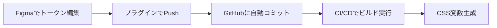

# Design Tokens Workflow - Phase 2実装

## 概要

このドキュメントでは、Figma + Storybook連携のPhase 2として実装されたDesign Tokens自動同期システムの使用方法を説明します。

## システム構成

### 1. Tokens Studio for Figmaプラグイン

- **目的**: FigmaでDesign Tokensを管理し、GitHubリポジトリと同期
- **設定ファイル**: `.tokens-studio/config.json`
- **同期先**: `tokens/` ディレクトリ

### 2. Style Dictionary

- **目的**: Design TokensをCSS変数やその他のフォーマットに変換
- **設定ファイル**: `config.json`
- **入力**: `tokens/**/*.json` (DTCG形式)
- **出力**:
  - `src/styles/tokens/variables.css` (Web用)
  - `build/css/_variables.css` (汎用)

### 3. トークンファイル構造

```
tokens/
├── ahamo-colors.json      # カラーパレット
├── ahamo-typography.json  # フォントサイズ・ウェイト
├── ahamo-spacing.json     # スペーシング・寸法
└── ahamo-effects.json     # シャドウ・ボーダー半径
```

## セットアップ手順

### 1. Figmaプラグインのインストール

1. Figmaで「Tokens Studio for Figma」プラグインをインストール
2. プラグインを開き、「Settings」→「Sync」を選択
3. 「GitHub」を選択し、以下の設定を入力：
   - **Repository**: `satoshi-watanabe-0001/ahamo-dummy-demo2-frontend-workspace`
   - **Branch**: `main`
   - **Path**: `tokens`
   - **Personal Access Token**: GitHubのPATを設定

### 2. GitHub Personal Access Token設定

1. GitHub Settings → Developer settings → Personal access tokens
2. 「Generate new token (classic)」を選択
3. 必要な権限:
   - `repo` (Full control of private repositories)
   - `workflow` (Update GitHub Action workflows)
4. 生成されたトークンをFigmaプラグインに設定

### 3. 初回同期

1. Figmaプラグインで「Pull from GitHub」を実行
2. 既存のトークンファイルが読み込まれることを確認
3. 必要に応じてトークンを編集
4. 「Push to GitHub」でリポジトリに反映

## 開発ワークフロー

### 1. デザイナーのワークフロー



### 2. 開発者のワークフロー

```bash
# トークンの手動ビルド
pnpm tokens:build

# トークンの監視モード（開発時）
pnpm tokens:watch

# 生成ファイルのクリーンアップ
pnpm tokens:clean

# Storybookでの確認
pnpm storybook
```

### 3. CI/CD統合

GitHub Actionsワークフローに以下のステップが追加されています：

```yaml
- name: Build Design Tokens
  run: pnpm tokens:build

- name: Verify Token Build
  run: |
    if [ ! -f "src/styles/tokens/variables.css" ]; then
      echo "Token build failed - variables.css not generated"
      exit 1
    fi
```

## トークンの使用方法

### 1. CSS変数として使用

```css
/* 生成されたCSS変数を使用 */
.button {
  background: linear-gradient(
    135deg,
    var(--color-primary-gradient-start),
    var(--color-primary-gradient-end)
  );
  padding: var(--spacing-md);
  border-radius: var(--border-radius-md);
  box-shadow: var(--shadow-md);
}
```

### 2. Storybookでの確認

各コンポーネントのストーリーで、生成されたCSS変数が正しく適用されることを確認できます。

## トラブルシューティング

### 1. 同期エラー

**症状**: Figmaプラグインで「Push to GitHub」が失敗する
**解決方法**:

- Personal Access Tokenの権限を確認
- リポジトリ名とブランチ名が正しいか確認
- ネットワーク接続を確認

### 2. ビルドエラー

**症状**: `pnpm tokens:build`が失敗する
**解決方法**:

```bash
# 依存関係の再インストール
pnpm install

# キャッシュのクリア
pnpm tokens:clean
pnpm tokens:build
```

### 3. CSS変数が反映されない

**症状**: Storybookでスタイルが適用されない
**解決方法**:

- `src/styles/tokens/variables.css`が生成されているか確認
- Storybookの設定でCSS変数ファイルがインポートされているか確認

## ファイル形式仕様

### DTCG (Design Token Community Group) 形式

```json
{
  "color": {
    "$type": "color",
    "primary": {
      "gradient-start": {
        "$value": "#f97316",
        "$description": "Primary gradient start color"
      }
    }
  }
}
```

### サポートされるトークンタイプ

- `color`: カラー値
- `fontSize`: フォントサイズ
- `fontWeight`: フォントウェイト
- `dimension`: スペーシング・寸法
- `borderRadius`: ボーダー半径
- `boxShadow`: シャドウ効果

## 今後の拡張予定

1. **自動化の強化**: Figmaでの変更を検知して自動的にPRを作成
2. **バリデーション**: トークン値の妥当性チェック
3. **ドキュメント生成**: トークン一覧の自動生成
4. **テーマ対応**: ライト/ダークテーマの切り替え対応

## 参考リンク

- [Tokens Studio for Figma Documentation](https://docs.tokens.studio/)
- [Style Dictionary Documentation](https://amzn.github.io/style-dictionary/)
- [Design Token Community Group](https://design-tokens.github.io/community-group/)
